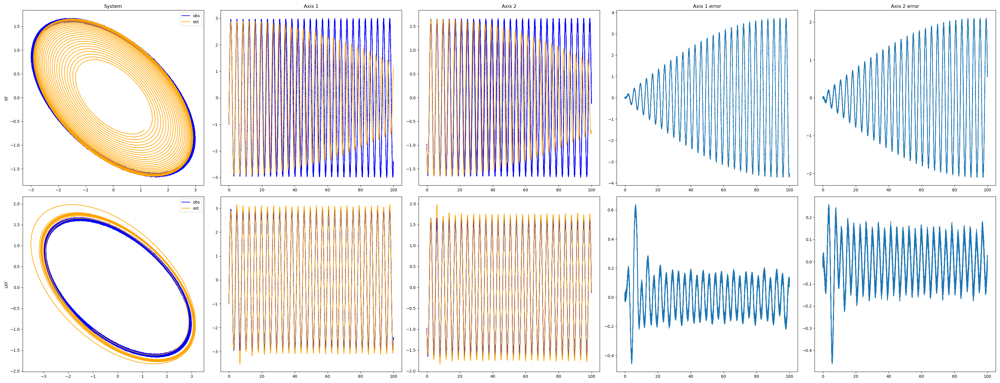
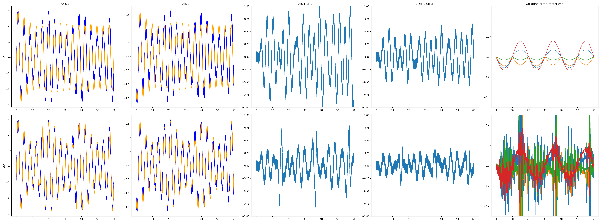

# Stochastic estimation of perturbed systems

"Learning Kalman Filter: a Variational Method for Online System Identification," under review. This library contains benchmarks for the continuous-time Kalman filter and its adaptive variant, Learning Kalman Filter. LKF performs online parameter adaptation by fluctuation suppression of the filter performance. Current benchmarks are structurally unstable 2x2 systems perturbed with Gaussian noise; higher-dimensional and nonlinear systems are forthcoming. 

Below are the scripts for exact replication on time-invariant and time-varying behavior. All experiments execute on dual-core Intel i5 processor in < 5 min.

## Installation
`pip install -r requirements.txt`

## Learning time-invariant systems
The effect of small ($\sigma^2 = 0.03$) modelling errors on different linear estimation algorithms.
* main: `python -m 2x2_lti_example`
* hyperparameter tuning: `python -m 2x2_hyp_gridsearch`, `python -m 2x2_hyp_tuning`

## Learning time-varying systems
Learning linear systems that smoothly vary in time, given only an instantaneous sampling of the model $F(t) = F(0) \forall t $. 
(_Note_: performance has been slightly improved since the original manuscript.)
Usage: `python -m 2x2_ltv_example`

